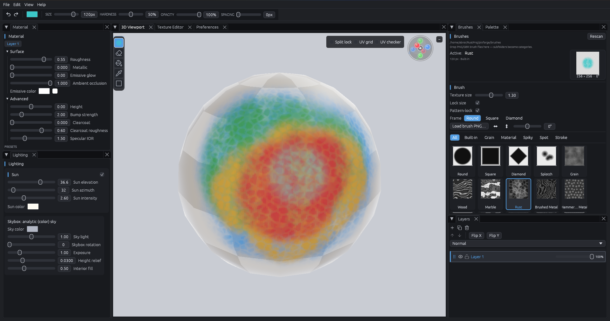
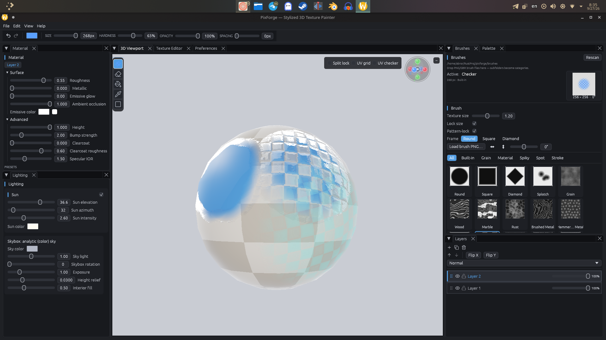

# PixForge

**Stylized 3D texture painter** — paint directly on your mesh with a stylized
PBR preview, then export a glTF 2.0 model with a full set of packed maps.

Built with Rust, [egui](https://github.com/emilk/egui) and
[wgpu](https://github.com/gfx-rs/wgpu). Native desktop, GPU-accelerated.



---

## Screenshots

### Metal vs non-metal

The **Metallic** slider swaps a dielectric response for a tinted metal one. The
material map is painted, not assigned, so metalness and roughness follow your
strokes across the surface.


### Height, bump and relief

**Height** raises the surface and **Bump strength** sharpens the normal
perturbation; both are applied as a Mikkelsen surface-gradient bump plus a
least-squares parallax offset, so the relief tracks the lighting in the 3D view
as well as the exported normal map.



---

## Features

- **Paint on the mesh, not on a flat plane.** Strokes are stamped in UV space
  with a real triangle BVH, a per-stroke occlusion grid, and facing/convexity
  gates so paint never bleeds through a wall or onto a back-facing surface.
- **Split lock.** Restrict a stroke to the welded mesh part under the brush, so
  a stroke can't bleed onto neighbouring parts of a hard-surface model.
- **Pattern-locked brushes.** Rubber-stamp or anchor-aligned phases. Anchored
  patterns ride the surface via a geodesic unfold (`SurfaceUnwrap`) instead of
  projecting through curvature, and the 3D cursor previews the exact texel-for-texel phase the stamp will apply.
- **Stylized PBR preview.** Forward-rendered GGX + height-correlated Smith +
  Schlick Fresnel, a second energy-conserving clearcoat lobe, 5-tap cosine
  ambient, HDRI or analytic sky, and an ACES filmic tonemap — tuned to read
  well while painting rather than to be physically exhaustive.
- **Layer stack with paintable material.** Each layer carries colour *and*
  material scalars (roughness, metallic, emissive, AO, height, bump, clearcoat,
  IOR). Material is composited from paint coverage, so a layer with
  `Metallic = 1` goes metal exactly where you painted it.
- **Layer blending** — Normal, Multiply, Screen, Overlay, with per-layer
  opacity, lock, visibility, reorder, duplicate and flip.
- **19 built-in brushes** (3 shapes + 16 procedural textures) plus **53 shipped
  brush-pack files**. Add your own PNG/JPG/BMP/WebP/GIF masks or GIMP `.gbr`
  brushes by dropping them in a folder — no rebuild needed.
- **Pattern-locked tiling windows** (Round / Square / Diamond) with a flat
  core and a C¹ skirt, so strokes don't show inter-dab density dips.
- **Fill bucket** with a colour-distance tolerance, UV-seam aware and
  island-bounded.
- **Relief from one slider.** Height, bump strength and parallax are all
  driven by the same signed height field, and the height atlas is baked into a
  tangent-space normal map on export using the same tilt cap as the shader.
- **glTF 2.0 export** — one `.glb` with base colour (+alpha), an ORM
  repack, tinted emissive, a baked normal map, and a shared
  clearcoat/clearcoat-roughness/IOR map wired to `KHR_materials_clearcoat` and
  `KHR_materials_ior`.
- **Docking UI** with persistent layout, per-panel memory and fully remappable
  keyboard shortcuts.
- **188 unit tests** covering brush math, paint geometry, blending, project
  I/O and the renderer's hostile-input validation.

---

## Requirements

- A **recent stable Rust** toolchain (edition 2021; developed against 1.95).
- A GPU with a **wgpu-supported backend** — Vulkan, Metal or DX12.
  Software rendering (lavapipe) works but is very slow; this is not a
  CPU-fallback app.
- No build-time asset pipeline. Everything is procedural or committed.

## Installing

Download the installer from the [GitHub
Releases](https://github.com/krubka1/pixforge/releases) and run it. It installs
to `%LOCALAPPDATA%\Programs\PixForge` for the current user — no admin rights, no
service or driver — and adds Start Menu and Desktop shortcuts.

The install layout is `bin\pixforge.exe` with `bin\brushes\` beside it, because
the brush folder is resolved relative to the executable: a Start Menu shortcut
leaves the working directory at `System32`, where a working-directory-relative
lookup would find nothing.

Building the installer yourself is covered in [RELEASE.md](RELEASE.md), which
also documents the portable zip (`packaging/build-portable.sh`) for handing a
build to testers without a Windows machine.

The stock `brushes/` library installs alongside the executable. Drop your own
`.png` / `.gbr` files in that folder (subfolders become categories) and they
show up in the Brush Library panel. Point `PIXFORGE_BRUSHES` somewhere else to
keep a separate library.

UI layout and custom palettes live in `%APPDATA%\pixforge` and survive both
reinstalls and upgrades.

Your settings and projects are left alone on uninstall.

## Building

```sh
git clone git@github.com:krubka1/pixforge.git
cd pixforge
cargo build --release
```

The release profile is already tuned (`lto = "thin"`, `codegen-units = 1`,
`opt-level = 3`); a debug build is usable but the paint and composite hot paths
are noticeably slower.

```sh
cargo run --release
```

### Regenerating the shipped brush packs

The `brushes/Material/*.png` files are generated deterministically in code.
To rebuild them into `./brushes` (or `$PIXFORGE_BRUSHES`, or an explicit path):

```sh
pixforge --gen-brush-packs [DIR]
```

This exits without starting the GUI. Set `PIXFORGE_BRUSHES` to load brush packs
from somewhere other than `./brushes` at runtime.

---

## Getting started

1. **File → Open Model…** and pick a `.gltf` or `.glb`. Distinct base-colour
   images are packed into a power-of-two atlas (up to 8192); skinned meshes are
   loaded in bind pose.
2. Pick a layer in the **Layers** panel. The **Material** panel above it sets
   that layer's surface response — start with **Clay** for a neutral preview.
3. Choose a brush in the **Brushes** panel and paint in the **3D Viewport**
   (left mouse) or the **Texture Editor** (left mouse). Both use the same brush
   engine.
4. **File → Save Project…** for a `.pixforge` file, or **Export GLB…** /
   **Export Albedo Atlas…** to ship.

### Navigation

| Input | Action |
| --- | --- |
| Left mouse | Paint / use the active tool |
| Right mouse | Brush popup (pick brush, colour, settings) |
| Middle mouse | Orbit |
| `Shift` + middle mouse | Pan |
| Wheel | Zoom |
| `Shift` + wheel | Brush size |

A vertical tool strip sits on the 3D viewport's left edge (`T`), an overlay bar
sits top-right (UV checker, UV grid, split lock), and a navigation gizmo gives
you six axis views plus home.

## Tools

| Tool | Key | Behaviour |
| --- | --- | --- |
| Brush | `B` | Continuous stamp; also the paint mode of the Rect tool |
| Eraser | `E` | Same dab pipeline with a transparent-core falloff |
| Fill Bucket | `G` | 4-connected flood fill with a `0.0..1.0` tolerance, UV-seam aware and island-bounded |
| Pipette | `I` | Samples the composited colour under the cursor |
| Rect Stamp | `R` | Drag a screen-space rect, stamps once |

## Keyboard shortcuts

All bindings are remappable in **Preferences → Shortcuts** (click a binding,
press a key, `Esc` to cancel). `Cmd` substitutes for `Ctrl` on macOS.

| Action | Default |
| --- | --- |
| Open Model | `Ctrl+O` |
| Open Project | `Ctrl+Shift+O` |
| Save Project | `Ctrl+S` |
| Open Environment | *unbound* |
| Brush / Eraser / Fill / Pipette / Rect | `B` / `E` / `G` / `I` / `R` |
| Brush size + / − | `]` / `[` |
| Brush opacity + / − | `Shift+}` / `Shift+{` |
| Toggle 3D tools bar / 2D tools bar | `T` / `T` |
| Toggle UV overlay bar (3D) | *unbound* |
| Fit camera (3D) / Fit canvas (2D) | `F` / `F` |
| Undo / Redo | `Ctrl+Z` / `Ctrl+Shift+Z` (also `Ctrl+Y`) |

Undo history is one snapshot per stroke (not per dab), bounded by both a step
count and a 256 MiB byte budget — the most recent step is always kept.

## Panels

| Panel | Contents |
| --- | --- |
| **3D Viewport** | Forward-rendered mesh preview, tool strip, overlay bar, nav gizmo |
| **Texture Editor** | 2D UV canvas with wireframe, zoom/pan, brush picker strip |
| **Layers** | Stack, blend mode, opacity, lock, visibility, reorder, rename, flip |
| **Material** | Per-layer roughness, metallic, emissive, AO, height, bump, clearcoat, IOR + presets (Clay, Glossy, Brushed metal, Cold metal) |
| **Lighting** | Sun (elevation, azimuth, intensity, colour) and skybox (colour, intensity, rotation, exposure, relief, interior fill) |
| **Brushes** | Built-ins and folder packs, category filter, thumbnails, live settings |
| **Palette** | Multiple palettes, GIMP `.gpl`, JASC `.pal`, plain text |
| **Preferences** | Theme, viewport overlays, shortcut rebinding |

## File formats

**Import** `.gltf`, `.glb` · `.hdr` and `.png`/`.jpg`/`.bmp`/`.webp` environments
and layer images · GIMP `.gbr` (v1/v2, depth 1 or 4) and image-mask brushes ·
`.gpl`, `.pal` and text palettes

**Save** `.pixforge` — a custom little-endian binary (version 6) with the mesh
geometry and each layer's atlas embedded as PNG. Older versions load with
defaults; unknown future versions are rejected.

**Export** `.glb` (5 packed maps) · `.png` flattened albedo atlas

Not supported: OBJ, FBX, USD/USDZ, KTX2/Basis, EXR, TIFF, and UDIM texture
sets. Environments are `.hdr` only among HDR formats.

---

## Brushes

The **Brushes** panel loads a folder at runtime (throttled to a 1.5 s rescan).
Each subfolder becomes a category, and every `.gbr` or image mask inside is
offered as a texture stamp. Drop files in — or point `PIXFORGE_BRUSHES`
somewhere else — to extend the library. See [`brushes/README.md`](brushes/README.md)
for per-pack sources and licenses.

Image masks use transparency as the dab; an opaque image is used inverted (dark
= strong paint). Built-in procedural brushes are generated deterministically in
code from the same noise core, so they carry no third-party license.

Brush settings: size `1..300px`, hardness, spacing, opacity, accumulate,
rotation, flip X/Y, texture scale, texture-size lock, pattern lock
(Dab / Aligned), and tiling window (Round / Square / Diamond).

## Adding your own

```sh
mkdir -p brushes/MyPack
cp my_textures/*.png brushes/MyPack/       # transparent = dab
pixforge                                    # rescan picks them up
```

Press **Rescan** in the Brushes panel to skip the throttle.

---

## How it works

```
src/
  main.rs       app bootstrap + --gen-brush-packs
  app.rs        UI, docking, tools, input, edit history
  render.rs     wgpu pipelines, passes, bind groups, uploads
  shader.wgsl   PBR, bump/parallax, IBL, tonemap, brush cursor
  paint.rs      raycasting, BVH, stamping, geodesic unfold, 2D stamp/fill
  brushes.rs    brush library, .gbr parser, procedural generators
  io.rs         atlases, blending, mesh load, glTF import/export, HDR
  project.rs    .pixforge binary format
  palette.rs    palette load/save
  brush/        geometry-free brush core: footprint, falloff, raster
```

A few notes on the internals, since they're the interesting part:

- **Compositing** is CPU-side, bottom-to-top source-over into four atlases:
  albedo (RGBA), material (R roughness, G metallic, B emissive/3, A AO),
  height (R signed height, G bump/8, B clearcoat, A IOR) and extras
  (R clearcoat roughness, GBA emissive tint). Row-parallel via Rayon above
  16K texels. Albedo blend modes deliberately don't affect the material map —
  those are physical properties, not colours.
- **Dirty rects** everywhere: a stroke patches only the edited texel range into
  the cached egui texture and into the GPU upload, instead of recompositing the
  whole atlas.
- **Acceleration** is built once per stroke (`StampAccel`): a binned-SAH
  triangle BVH (O(N) per node, candidate list reused to avoid per-dab
  allocation), an occlusion grid, and a watertight convexity test that lets
  closed solids take a dot-product visibility fast path.
- **Height and extras atlases are intentionally sampler-less** in the bind group
  and share the material sampler, guaranteeing that parallax shifts every map
  by the identical offset — a mismatch would shear the relief against its
  material.
- **The brush cursor** is a surface-conforming mask: the mesh is re-traced and
  depth-tested against the opaque pass with a facing test, drawn as two ordered
  passes (source-over scrim + additive glow) so it stays readable in any
  lighting.
- **Environment** is either an analytic sky or an equirect HDRI with a
  peak-normalised CPU-built mip chain. AO scales diffuse only, and specular
  ambient is deliberately un-guarded by `NdotL` — either shortcut turns rough
  metals black.

## Tests

```sh
cargo test
```

188 tests (185 run, 3 ignored): brush math, footprint/falloff/raster, paint
geometry and visibility, blending and atlas compositing, the `.pixforge`
reader's bounds checking against hostile input, palette handling, and renderer
state — including offscreen GPU tests.

## Release checks

The WiX sources are validated without needing Windows:

```sh
python3 packaging/gen_wix_brushes.py   # regenerate after changing brushes/
python3 packaging/check_wix.py         # structural validation
```

`check_wix.py` catches dangling `ComponentRef`/`DirectoryRef` targets, duplicate
WiX ids, unresolved `Source=` paths, a `perUser` scope that no longer matches the
install root, a machine-wide PATH write, and a brush library that has gone
missing from the MSI. It cannot replace building the actual installer — see
[RELEASE.md](RELEASE.md).

## License

GPL-3.0 — see [LICENSE](LICENSE).

Bundled brush packs from
[gimp-brush-collection](https://github.com/vascoalexander/gimp-brush-collection)
by Vasco Alexander Basque, CC0 1.0. Everything else, including the built-in
procedural brushes, is original work under the GPL-3.0.
